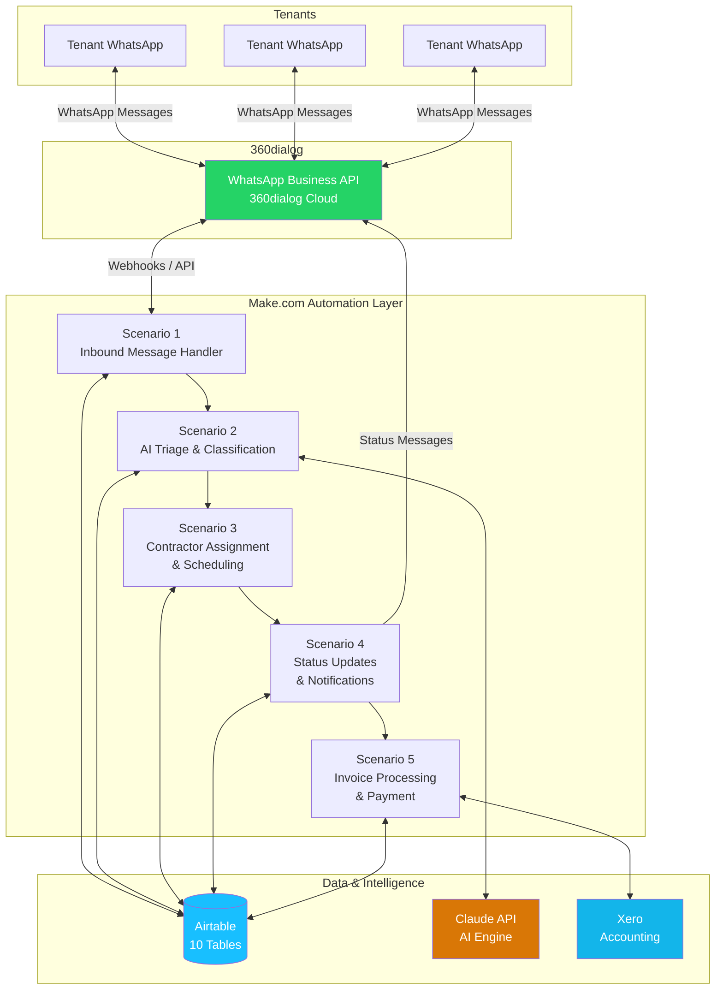
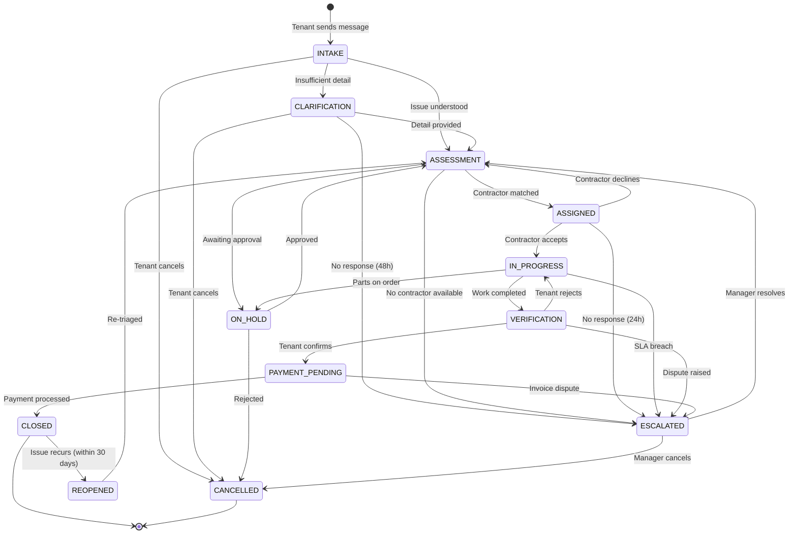

# SafeFlow - WhatsApp Facilities Management System

[](https://github.com/SafeFlow/SafeFlow/actions)
[](LICENSE)
[](CHANGELOG.md)
[](https://www.360dialog.com/)
[](https://airtable.com/)

---

## Overview

SafeFlow is a **production-grade, WhatsApp-based facilities management system** purpose-built for UK commercial properties. It enables tenants to report maintenance issues, track repair progress, and receive real-time updates — all through WhatsApp, the messaging platform they already use daily.

The system orchestrates the full lifecycle of a maintenance request: from initial intake through AI-powered triage and classification, contractor assignment and scheduling, work verification with photographic evidence, through to invoice processing and payment via Xero. Every interaction is conversational, multilingual-ready, and designed to minimise friction for tenants while giving property managers complete operational visibility through Airtable dashboards.

SafeFlow is built on a no-code/low-code automation backbone (Make.com), augmented by Claude AI for natural language understanding and intelligent decision-making, making it maintainable by operations teams without dedicated software engineering resources.

---

## Architecture



### Data Flow Summary

1. **Tenant** sends a WhatsApp message describing a maintenance issue (text, photo, or voice note).
2. **360dialog** receives the message via the WhatsApp Business API and forwards it to Make.com via webhook.
3. **Scenario 1** (Inbound Message Handler) parses the message, identifies or creates the tenant record in Airtable, and determines whether this is a new request or a reply to an existing job.
4. **Scenario 2** (AI Triage & Classification) sends the message content to **Claude API** for natural language understanding — extracting issue category, urgency, location, and generating a structured summary.
5. **Scenario 3** (Contractor Assignment & Scheduling) matches the classified issue to available contractors based on trade, availability, location, and SLA requirements.
6. **Scenario 4** (Status Updates & Notifications) sends confirmation messages, progress updates, and completion notifications back to the tenant via WhatsApp.
7. **Scenario 5** (Invoice Processing & Payment) handles contractor invoices, validates them against approved quotes, and pushes approved invoices to **Xero** for payment.

---

## Tech Stack

| Component | Technology | Version | Purpose |
|---|---|---|---|
| **Messaging** | 360dialog WhatsApp Business API | v2.x | Tenant communication channel |
| **Automation** | Make.com (formerly Integromat) | — | Workflow orchestration (6 scenarios) |
| **Database** | Airtable | — | Operational data store (9 tables) |
| **AI Engine** | Anthropic Claude API | claude-sonnet-4-20250514 | NLU, triage, classification, summarisation |
| **Accounting** | Xero API | v2.0 | Invoice and payment processing |
| **Testing** | k6 | v0.50+ | Load and performance testing |
| **Testing** | pytest | v8.x | Prompt and integration testing |
| **Version Control** | Git + GitHub | — | Source control and CI/CD |
| **CI/CD** | GitHub Actions | — | Automated testing and deployment |

---

## Directory Structure

```
SafeFlow/
├── README.md
├── LICENSE
├── CHANGELOG.md
├── .gitignore
├── .github/
│   ├── workflows/
│   │   ├── ci.yml
│   │   ├── deploy-staging.yml
│   │   └── deploy-production.yml
│   ├── ISSUE_TEMPLATE/
│   │   ├── bug_report.md
│   │   └── feature_request.md
│   └── PULL_REQUEST_TEMPLATE.md
├── docs/
│   ├── architecture/
│   │   ├── system-overview.md
│   │   ├── data-flow.md
│   │   └── state-machine.md
│   ├── setup/
│   │   ├── 360dialog-setup.md
│   │   ├── airtable-setup.md
│   │   ├── make-setup.md
│   │   └── xero-setup.md
│   ├── runbooks/
│   │   ├── incident-response.md
│   │   ├── escalation-procedures.md
│   │   └── common-issues.md
│   └── api/
│       ├── webhook-spec.md
│       └── message-formats.md
├── scenarios/
│   ├── 01-inbound-message-handler/
│   │   ├── blueprint.json
│   │   ├── README.md
│   │   └── tests/
│   ├── 02-ai-triage-classification/
│   │   ├── blueprint.json
│   │   ├── README.md
│   │   └── tests/
│   ├── 03-contractor-assignment/
│   │   ├── blueprint.json
│   │   ├── README.md
│   │   └── tests/
│   ├── 04-status-updates-notifications/
│   │   ├── blueprint.json
│   │   ├── README.md
│   │   └── tests/
│   └── 05-invoice-processing-payment/
│       ├── blueprint.json
│       ├── README.md
│       └── tests/
├── airtable/
│   ├── schema/
│   │   ├── tables.json
│   │   ├── views.json
│   │   └── automations.json
│   ├── scripts/
│   │   ├── seed-data.js
│   │   ├── migrate.js
│   │   └── backup.js
│   └── backups/
│       └── .gitkeep
├── llm-prompts/
│   ├── triage/
│   │   ├── system-prompt.md
│   │   ├── few-shot-examples.json
│   │   └── evaluation-results/
│   │       └── .gitkeep
│   ├── classification/
│   │   ├── system-prompt.md
│   │   ├── category-taxonomy.json
│   │   └── evaluation-results/
│   │       └── .gitkeep
│   ├── summarisation/
│   │   ├── system-prompt.md
│   │   └── evaluation-results/
│   │       └── .gitkeep
│   └── response-generation/
│       ├── system-prompt.md
│       ├── tone-guidelines.md
│       └── evaluation-results/
│           └── .gitkeep
├── templates/
│   ├── whatsapp/
│   │   ├── welcome.json
│   │   ├── job-confirmation.json
│   │   ├── status-update.json
│   │   ├── contractor-assigned.json
│   │   ├── verification-request.json
│   │   ├── job-closed.json
│   │   └── escalation-notice.json
│   └── email/
│       ├── contractor-notification.html
│       ├── manager-daily-digest.html
│       └── invoice-approved.html
├── tests/
│   ├── conftest.py
│   ├── unit/
│   │   ├── test_prompt_triage.py
│   │   ├── test_prompt_classification.py
│   │   └── test_message_parsing.py
│   ├── integration/
│   │   ├── test_webhook_flow.py
│   │   ├── test_airtable_operations.py
│   │   └── test_xero_integration.py
│   ├── e2e/
│   │   ├── test_full_job_lifecycle.py
│   │   └── test_escalation_flow.py
│   ├── load/
│   │   ├── k6-inbound-messages.js
│   │   ├── k6-concurrent-jobs.js
│   │   └── k6-config.json
│   └── fixtures/
│       ├── sample-messages.json
│       ├── sample-jobs.json
│       └── sample-invoices.json
├── scripts/
│   ├── setup.sh
│   ├── validate-env.sh
│   ├── deploy.sh
│   └── health-check.sh
├── config/
│   ├── .env.example
│   ├── categories.json
│   ├── sla-definitions.json
│   ├── escalation-rules.json
│   └── contractor-trades.json
└── k6-results/
    └── .gitkeep
```

---

## Quick Start

> **Estimated setup time: 15 minutes**

### Prerequisites

- A [360dialog](https://www.360dialog.com/) account with an approved WhatsApp Business number
- A [Make.com](https://www.make.com/) account (Teams plan or above recommended)
- An [Airtable](https://airtable.com/) account (Pro plan or above for automation features)
- An [Anthropic](https://console.anthropic.com/) API key for Claude
- A [Xero](https://www.xero.com/uk/) account (for invoice processing)
- [Node.js](https://nodejs.org/) v18+ and [Python](https://www.python.org/) 3.11+ (for tooling and tests)

### Steps

**1. Clone the repository**

```bash
git clone https://github.com/SafeFlow/SafeFlow.git
cd SafeFlow
```

**2. Configure environment variables**

```bash
cp config/.env.example .env
```

Edit `.env` and populate the required values:

```env
# 360dialog
DIALOG_API_KEY=your_360dialog_api_key
DIALOG_WEBHOOK_URL=https://your-webhook-url.com/inbound

# Airtable
AIRTABLE_API_KEY=your_airtable_api_key
AIRTABLE_BASE_ID=your_base_id

# Anthropic
ANTHROPIC_API_KEY=sk-ant-...

# Xero
XERO_CLIENT_ID=your_xero_client_id
XERO_CLIENT_SECRET=your_xero_client_secret
XERO_TENANT_ID=your_xero_tenant_id

# Make.com
MAKE_API_TOKEN=your_make_api_token
```

**3. Set up Airtable schema**

```bash
node airtable/scripts/seed-data.js
```

This creates all 9 tables with the correct field types, views, and seed data. See [Airtable Setup Guide](docs/setup/airtable-setup.md) for manual configuration.

**4. Import Make.com scenarios**

Import each scenario blueprint into Make.com in order:

1. `scenarios/01-inbound-message-handler/blueprint.json`
2. `scenarios/02-ai-triage-classification/blueprint.json`
3. `scenarios/03-contractor-assignment/blueprint.json`
4. `scenarios/04-status-updates-notifications/blueprint.json`
5. `scenarios/05-invoice-processing-payment/blueprint.json`

Update the connection credentials within each scenario to match your environment. Refer to [Make.com Setup Guide](docs/setup/make-setup.md) for detailed instructions.

**5. Configure 360dialog webhook**

Point your 360dialog webhook URL to the Make.com webhook trigger in Scenario 1. See [360dialog Setup Guide](docs/setup/360dialog-setup.md).

**6. Validate the setup**

```bash
bash scripts/validate-env.sh
bash scripts/health-check.sh
```

**7. Run the test suite**

```bash
# Install test dependencies
pip install -r requirements-test.txt
npm install

# Run unit tests
pytest tests/unit/ -v

# Run integration tests (requires live credentials)
pytest tests/integration/ -v --env=staging
```

**8. Send a test message**

Send a WhatsApp message to your configured business number:

> "Hi, the hot water in Unit 4B has stopped working. No hot water at all since this morning."

You should see the message appear in Airtable within seconds, classified and triaged by Claude.

---

## State Machine

SafeFlow manages every maintenance job through a **12-state finite state machine**. Each transition is logged in Airtable with a timestamp, the triggering actor, and any associated metadata.



### State Descriptions

| State | Description |
|---|---|
| **INTAKE** | Initial message received. The system is parsing and understanding the tenant's request. |
| **CLARIFICATION** | The AI has determined that additional information is needed from the tenant before the issue can be triaged (e.g., location, photos, or further description). |
| **ASSESSMENT** | The issue is fully understood and classified. The system is evaluating urgency, category, and SLA requirements to determine the appropriate contractor. |
| **ASSIGNED** | A contractor has been matched and notified. Awaiting contractor acceptance. |
| **IN_PROGRESS** | The contractor has accepted the job and work is underway. The tenant receives progress updates. |
| **VERIFICATION** | The contractor has marked the work as complete. The tenant is asked to confirm the issue is resolved, optionally with photographic evidence. |
| **PAYMENT_PENDING** | The tenant has confirmed the work is satisfactory. The contractor's invoice is being processed through Xero. |
| **CLOSED** | The job is fully resolved and the invoice has been paid. The record is retained for reporting and audit purposes. |
| **ESCALATED** | The job has been escalated to a property manager due to SLA breach, contractor unavailability, tenant dispute, or other exceptional circumstances. |
| **ON_HOLD** | The job is temporarily paused — awaiting management approval, parts delivery, or external dependency resolution. |
| **CANCELLED** | The job has been cancelled by the tenant or a property manager. The reason is logged for audit. |
| **REOPENED** | A previously closed job has been reopened because the issue has recurred within the 30-day warranty window. |

---

## Airtable Schema (10 Tables)

| Table | Purpose | Key Fields |
|---|---|---|
| **Tenants** | Tenant contact directory | Name, Phone, Unit, Property, Language |
| **Properties** | Property register | Address, Postcode, Manager, SLA Tier |
| **Jobs** | Core maintenance job tracker | Status, Category, Urgency, SLA Deadline, Linked Tenant, Linked Contractor |
| **Messages** | Full message audit log | Direction, Content, Media URLs, Linked Job, Timestamp |
| **Contractors** | Contractor directory | Name, Trades, Availability, Rating, Contact, ComplianceStatus, NextExpiryDate |
| **Invoices** | Invoice tracking | Amount, Status, Xero ID, Linked Job, Linked Contractor |
| **SLA Rules** | SLA configuration by category/urgency | Category, Urgency, Response Time, Resolution Time |
| **Escalations** | Escalation records | Reason, Linked Job, Assigned Manager, Resolution |
| **Audit Log** | Immutable state transition log | Job ID, From State, To State, Actor, Timestamp, Metadata |

---

## Development Workflow

### Branching Strategy

SafeFlow follows a **trunk-based development** model:

- `main` — production-ready, protected branch
- `staging` — pre-production validation
- `feature/<description>` — short-lived feature branches
- `fix/<description>` — bug fix branches

### Making Changes

1. Create a feature branch from `main`:
   ```bash
   git checkout -b feature/add-voice-note-support
   ```

2. Make your changes and run the relevant tests:
   ```bash
   pytest tests/unit/ -v
   ```

3. Commit using [Conventional Commits](https://www.conventionalcommits.org/):
   ```bash
   git commit -m "feat: add voice note transcription via Claude"
   ```

4. Push and open a pull request against `main`:
   ```bash
   git push -u origin feature/add-voice-note-support
   gh pr create --title "feat: add voice note support" --body "..."
   ```

### LLM Prompt Changes

When modifying any prompt in `llm-prompts/`:

1. Update the prompt file.
2. Run the evaluation suite against the test fixtures:
   ```bash
   pytest tests/unit/test_prompt_triage.py -v --eval
   ```
3. Review the evaluation results in `llm-prompts/<prompt>/evaluation-results/`.
4. Include evaluation metrics in your pull request description.

### Running Load Tests

```bash
k6 run tests/load/k6-inbound-messages.js --out json=k6-results/inbound.json
```

---

## Deployment

### Environments

| Environment | Purpose | Make.com Org | Airtable Base |
|---|---|---|---|
| **Development** | Local testing and prompt iteration | Dev workspace | Dev base |
| **Staging** | Pre-production validation with live APIs | Staging workspace | Staging base |
| **Production** | Live tenant-facing system | Production workspace | Production base |

### Deployment Process

1. **Merge to `main`** triggers the CI pipeline (`.github/workflows/ci.yml`).
2. **CI validates**: prompt evaluations pass, unit tests pass, integration tests pass.
3. **Deploy to staging** (`.github/workflows/deploy-staging.yml`):
   - Exports scenario blueprints and pushes to Make.com staging workspace.
   - Runs smoke tests against the staging environment.
4. **Manual approval gate** for production deployment.
5. **Deploy to production** (`.github/workflows/deploy-production.yml`):
   - Pushes approved blueprints to the production Make.com workspace.
   - Runs health checks.
   - Notifies the team via Slack.

### Rollback

In the event of a production issue:

```bash
bash scripts/deploy.sh rollback production
```

This reverts Make.com scenarios to the previous blueprint version and restores Airtable automations from the latest backup.

---

## Monitoring & Observability

- **Make.com execution logs** — real-time scenario execution monitoring
- **Airtable Audit Log table** — immutable record of every state transition
- **Health check endpoint** — `scripts/health-check.sh` validates all integrations
- **Daily digest emails** — automated manager reports via Scenario 4
- **SLA breach alerts** — immediate escalation notifications when deadlines are missed

---

## Contractor Compliance Expiry Guard

SafeFlow enforces contractor certification compliance at assignment time and runs daily proactive checks.

### How it works

1. **Daily sweep (Scenario F)** runs at 07:00 UK time. For every ACTIVE contractor, it evaluates Gas Safe and NICEIC expiry dates and writes `compliance_status` + `next_expiry_date` back to the Contractors table.
2. **Assignment filter** — `lib/assignment.py` (Filter 5) rejects any contractor with `compliance_status = EXPIRED`. EXPIRING_SOON contractors remain assignable.
3. **Auto-alerts** — EXPIRED contractors trigger a HIGH severity alert to property managers; EXPIRING_SOON contractors trigger a MEDIUM severity warning. Both are delivered via Scenario C (outbound notifications).
4. **Airtable view** — The "Compliance Expiring" view on the Contractors table surfaces all at-risk contractors sorted by nearest expiry date.

### Compliance statuses

| Status | Meaning |
|---|---|
| **COMPLIANT** | All certs valid, earliest expiry > 30 days away |
| **EXPIRING_SOON** | At least one cert expires within 30 days |
| **EXPIRED** | At least one cert is past its expiry date — **blocked from assignment** |
| **NOT_VERIFIED** | No expiry dates recorded |

### Future: Document upload via WhatsApp

A vision prompt (`llm-prompts/compliance/expiry-extract-vision.md`) is prepared for extracting expiry dates from photos of certification documents sent via WhatsApp. This is not yet integrated into any scenario.

---

## Contributing

We welcome contributions! Please read our [Contributing Guide](CONTRIBUTING.md) before submitting a pull request.

### Key Guidelines

- Follow the branching strategy outlined above.
- All prompt changes must include evaluation results.
- Use UK English throughout all documentation and user-facing strings.
- Ensure all tests pass before opening a pull request.
- Keep Make.com scenario blueprints in sync with the repository.

---

## Licence

This project is licenced under the [MIT Licence](LICENSE).

---

<p align="centre">
  <strong>SafeFlow</strong> — Making facilities management effortless, one WhatsApp message at a time.
</p>
