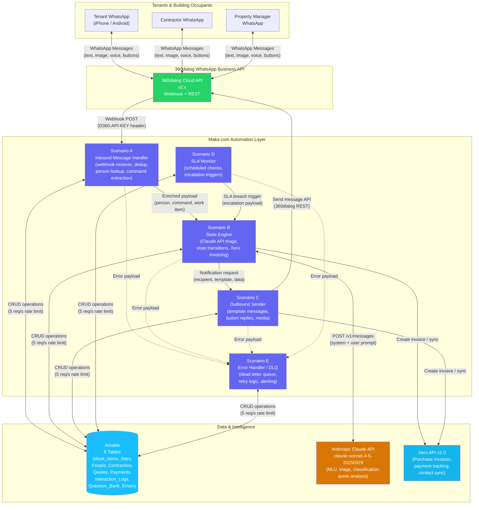

# SafeFlow System Architecture Overview

## Overview

SafeFlow is a production-grade, WhatsApp-based facilities management system purpose-built for UK commercial properties. It orchestrates the full lifecycle of maintenance requests -- from tenant intake through AI-powered triage, contractor assignment, work verification, and invoice processing -- using a no-code/low-code automation backbone. The platform integrates 360dialog (WhatsApp Business API), Make.com (workflow orchestration across 5 scenarios), Airtable (operational data store with 9 tables), Anthropic Claude API (natural language understanding and intelligent decision-making), and Xero (accounting and invoice processing). Every work order progresses through a deterministic 12-state finite state machine, ensuring auditability, SLA compliance, and consistent tenant experience across all managed properties.

---

## Architecture Diagram

---

## Component Descriptions

### 360dialog -- WhatsApp Business API Gateway

360dialog provides the WhatsApp Business API endpoint that connects SafeFlow to the WhatsApp network. It acts as a gateway between WhatsApp's infrastructure and the Make.com automation layer.

- **Inbound**: Receives tenant, contractor, and manager WhatsApp messages and forwards them as webhook POST requests to Scenario A. Each webhook includes a `D360-API-KEY` header for verification.
- **Outbound**: Exposes a REST API for sending template messages, free-form text, interactive button/list replies, and media (images, documents) back to users.
- **Message types supported**: text, image, document, audio, video, interactive (button reply, list reply).
- **Deployment region**: EU (eu1/eu2) for GDPR compliance.

### Make.com -- Workflow Orchestration (5 Scenarios)

Make.com (formerly Integromat) provides the no-code automation backbone. Each scenario is a discrete workflow triggered by webhooks or schedules.

| Scenario | Name | Trigger | Purpose |
|----------|------|---------|---------|
| **A** | Inbound Message Handler | 360dialog webhook | Receives all inbound WhatsApp messages, deduplicates, looks up or creates person records, extracts commands and job references, logs interactions, and hands off to Scenario B. |
| **B** | State Engine | Webhook from A or D | Core business logic. Implements the 12-state work order machine. Calls Claude API for triage, validates state transitions, persists changes to Airtable, creates Xero invoices, and triggers notifications via Scenario C. |
| **C** | Outbound Sender | Webhook from B | Sends WhatsApp messages back to users via 360dialog API. Handles template selection, button construction, media attachment, and delivery status tracking. |
| **D** | SLA Monitor | Scheduled (every 15 min) | Scans Airtable for work items approaching or breaching SLA deadlines. Triggers escalation transitions via Scenario B. Detects and releases stale state locks. |
| **E** | Error Handler / DLQ | Webhooks from A-D | Dead letter queue for failed operations. Logs errors to the Errors table, implements retry logic with exponential backoff, and sends alert notifications to the operations team. |

### Airtable -- Operational Data Store (9 Tables)

Airtable serves as the central data store, providing both structured storage and a visual interface for property managers.

| Table | Records Volume | Purpose |
|-------|---------------|---------|
| **Work_Items** | High (thousands/month) | Core work order tracking with 35 fields, including the 12-state machine, SLA deadlines, LLM-extracted data, location fields, and cost tracking. 4 formula fields for computed values (time_in_current_state, is_overdue, days_since_created, priority_score). 7 views including Kanban board. |
| **Sites** | Low (tens) | UK commercial property definitions with 20 fields. Includes address, postcode, SLA tier, property manager link, emergency contacts, and preferred contractor assignments. |
| **People** | Medium (hundreds) | All system users -- tenants, engineers, supervisors, managers. Stores WhatsApp numbers, roles, site assignments, and interaction history. |
| **Contractors** | Medium (hundreds) | External contractor registry with 25 fields. Tracks trade disciplines, certifications (Gas Safe, NICEIC), coverage postcodes, hourly rates, callout fees, ratings, and Xero contact IDs. |
| **Quotes** | Medium | RFQ responses from contractors with 17 fields. Cost breakdowns (labour + materials), VAT calculations, lead times, validity dates, and approval status (REQUESTED, SUBMITTED, ACCEPTED, REJECTED, EXPIRED, WITHDRAWN). |
| **Payments** | Medium | Invoice and payment tracking with 17 fields. Links to Xero invoices, tracks payment status, amounts in GBP, and approval workflows. |
| **Interaction_Logs** | High (thousands/month) | Immutable audit log of every WhatsApp message -- inbound and outbound. Stores message content, media URLs, delivery status, LLM processing results, and scenario execution IDs. |
| **Question_Bank** | Low (tens) | Pre-defined clarification questions organised by category and language. Used by the LLM to generate contextually appropriate follow-up questions. |
| **Errors** | Variable | System error logging. Captures scenario failures, API errors, rate limit hits, and other operational issues for investigation and replay. |

### Anthropic Claude API -- AI Engine

Claude provides natural language understanding and intelligent decision-making at two key points in the workflow:

1. **Intake Triage (Scenario B)**: Analyses incoming WhatsApp messages to extract structured data -- issue category, trade discipline, urgency level, location, and routing decision. Returns a confidence score; messages below 0.7 confidence trigger the clarification flow.
2. **Quote Analysis**: Compares contractor quotes for the same work item, detecting outliers, analysing cost breakdowns, and recommending the best-value option.

- **Model**: claude-sonnet-4-5-20250929
- **Temperature**: 0.2 (deterministic outputs for consistent triage)
- **Max tokens**: 1,500
- **Cost**: Approximately GBP 2.70/month at current volumes (50 messages/day, ~30 requiring triage)

### Xero -- Accounting Integration

Xero handles all financial operations:

- **Purchase invoices**: Created automatically when work items reach CLOSED or PAYMENT_PENDING state with a contractor assigned. Invoices are created as DRAFT in GBP with the reference SF-{work_item_id}.
- **Contact sync**: Contractor records in Airtable are linked to Xero contacts via `xero_contact_id`.
- **Tax handling**: Standard UK VAT at 20% (tax type OUTPUT2).
- **Payment terms**: Configurable per contractor (NET_7, NET_14, NET_30, NET_60).

---

## Data Flow

### Inbound Message Flow (Tenant Reports Issue)

1. **Tenant** sends a WhatsApp message (text, photo, or voice note) describing a maintenance issue.
2. **360dialog** receives the message via the WhatsApp Business API and forwards it to **Scenario A** via webhook POST with `D360-API-KEY` header.
3. **Scenario A** parses the message payload, checks the deduplication data store (72-hour TTL), looks up the sender in the People table (or auto-creates a TENANT record for unknown senders), extracts any commands (DONE, ACCEPT, START, etc.) and job references (SF-XXXX), logs the interaction to Interaction_Logs, and POSTs an enriched payload to **Scenario B**.
4. **Scenario B** acquires an optimistic lock on the work item (if existing), calls the **Claude API** for intake triage (extracting discipline, urgency, location, routing decision), validates the proposed state transition against the 12-state machine rules, persists the state change to Airtable, updates the Interaction_Log with LLM results, and triggers side effects (notifications, Xero invoice creation) via **Scenario C**.
5. **Scenario C** selects the appropriate WhatsApp message template, constructs interactive buttons where applicable, and sends the response to the tenant via the **360dialog** REST API.

### SLA Monitoring Flow

1. **Scenario D** runs on a 15-minute schedule.
2. It queries Airtable for work items approaching or past their SLA deadlines.
3. For items exceeding thresholds, it sends escalation payloads to **Scenario B**, which transitions them to ESCALATED state.
4. It also detects stale state locks (held for >5 minutes) and releases them.

### Error Handling Flow

1. Any scenario (A-D) encountering an unrecoverable error forwards the full error context and original payload to **Scenario E**.
2. Scenario E logs the error to the Errors table with severity, module, and execution context.
3. Retryable errors are re-queued with exponential backoff.
4. Critical errors trigger alerts via Slack, email, and PagerDuty.

---

## Security Model

### Authentication & Authorisation

| Integration | Authentication Method | Details |
|-------------|----------------------|---------|
| 360dialog webhook | API key header | `D360-API-KEY` header validated on every inbound webhook. Requests without a valid key are rejected. |
| Airtable API | Personal access token | `pat...` token with scoped permissions per base. Stored as Make.com connection credential, never in code. |
| Anthropic API | API key | `sk-ant-...` key stored as Make.com connection credential. |
| Xero API | OAuth 2.0 | Client credentials flow with automatic token refresh. Scoped to invoicing and contacts. |
| Make.com webhooks | URL obscurity + source headers | Webhook URLs are unguessable UUIDs. Scenario B validates `X-Source-Scenario` header to ensure requests originate from legitimate upstream scenarios. |

### Data Protection

- **No PII in logs**: System logs (Make.com execution history, error records) never contain tenant phone numbers, names, or message content in plain text. Sensitive fields are referenced by Airtable record ID only.
- **Airtable access control**: Base-level permissions restrict access to authorised team members. Field-level permissions hide sensitive data from non-admin roles.
- **GDPR compliance**: 360dialog operates within the EU. Message content is processed transiently by Claude API and not retained by Anthropic beyond the API request lifecycle.
- **Data retention**: Interaction_Logs are retained for 12 months. Closed work items are retained indefinitely for audit. Personal data can be deleted on request (right to erasure).

### Secrets Management

- All API keys and credentials are stored as Make.com connection credentials, encrypted at rest.
- Environment-specific configuration files (`.env`) are excluded from version control via `.gitignore`.
- Production credentials are never stored in the repository.

---

## Rate Limits

| Service | Rate Limit | SafeFlow Usage (Typical) | Headroom | Mitigation Strategy |
|---------|-----------|--------------------------|----------|-------------------|
| **360dialog** | 250 messages/second | ~0.03 msg/s (50 msg/day) | >8000x | No mitigation needed at current scale |
| **Airtable** | 5 requests/second per base | ~0.5 req/s (3-6 calls per message) | ~10x | Make.com automatic retry with backoff. Batch writes where possible. |
| **Anthropic Claude API** | 50 requests/minute (Tier 1) / 4,000 req/min (Tier 2) | ~2 req/min (30 triage calls/day) | ~25x (Tier 1) | Retry with exponential backoff. LLM bypass for explicit commands. |
| **Xero API** | 60 requests/minute | ~5 req/day (invoice creation only on closure) | >1000x | No mitigation needed at current scale |
| **Make.com** | Varies by plan (Operations/month) | ~30,000 operations/month | Depends on plan | Monitor usage dashboard. Upgrade plan if approaching limits. |

---

## Error Handling Strategy

SafeFlow implements a defence-in-depth error handling strategy:

### Per-Module Error Handling

Each Make.com module has an appropriate error strategy:

| Strategy | Used By | Behaviour |
|----------|---------|-----------|
| **Retry** | LLM triage, Airtable writes | Automatic retry (up to 3 attempts) with exponential backoff for transient errors (429, 500, 502, 503, 504). |
| **Ignore** | Non-critical logging (Interaction_Log update) | Log the error but continue execution. Prevents non-critical failures from blocking work order processing. |
| **Route to DLQ** | All critical modules | Forward the full error context and original payload to Scenario E for later investigation and manual replay. |
| **Always return 200** | Scenario A webhook response | Always acknowledge 360dialog webhooks to prevent retry storms that would compound errors. |

### Dead Letter Queue (Scenario E)

- Receives error payloads from all upstream scenarios.
- Logs to the Errors table with: scenario, error_type, error_message, module_id, module_name, original payload, execution_id, and timestamp.
- Classifies errors by severity (CRITICAL, HIGH, MEDIUM, LOW).
- Sends alerts via configured channels (Slack, email, PagerDuty) based on severity.

### State Lock Safety

- Optimistic locking prevents concurrent modification of work items.
- If an error occurs after lock acquisition, the global error handler releases the lock before routing to the DLQ.
- Scenario D's scheduled runs detect and release stale locks (held >5 minutes).

---

## Scalability Considerations

### Current Capacity

SafeFlow is designed for small-to-medium UK commercial property portfolios:

- **50-100 messages/day** across all tenants and contractors.
- **~30 LLM triage calls/day**.
- **~30,000 Make.com operations/month**.

### Scaling Bottlenecks (In Order of Likelihood)

1. **Airtable rate limit (5 req/s)**: The primary constraint. At sustained inbound rates above 1 message/second, Airtable rate limiting will occur. Mitigations:
   - Batch Airtable writes into a separate asynchronous scenario.
   - Split high-volume tables into separate bases.
   - Consider migrating to a dedicated database (PostgreSQL) for Interaction_Logs.

2. **Make.com operations quota**: Plan-dependent. Monitor monthly usage and upgrade before reaching limits.

3. **Anthropic API rate limits**: Unlikely to be a bottleneck. At Tier 1 (50 req/min), SafeFlow uses approximately 4% of available capacity.

4. **360dialog throughput (250 msg/s)**: Will not be a bottleneck for any realistic FM workload.

### Horizontal Scaling Options

- **Multi-base Airtable**: Partition by region or property portfolio to distribute load across bases (each with its own 5 req/s limit).
- **Parallel scenarios**: Split Airtable I/O into dedicated scenarios triggered via intermediate webhooks.
- **Database migration**: For volumes exceeding 10,000 messages/day, migrate Interaction_Logs and Errors to a dedicated PostgreSQL instance accessed via Make.com HTTP modules.
- **Multiple WhatsApp numbers**: Use separate 360dialog numbers per property portfolio, each with its own Scenario A instance.
