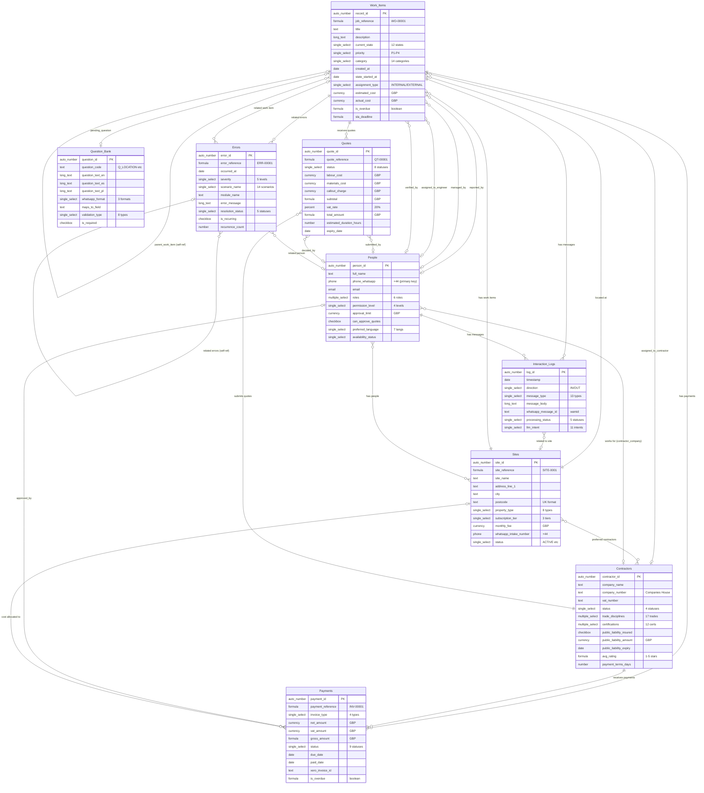

# SafeFlow — Entity Relationship Diagram

---

## Relationship Summary Table

| From Table | Field | To Table | Cardinality | Description |
|-----------|-------|----------|-------------|-------------|
| Work_Items | `site` | Sites | Many-to-One | Each job is at one site; a site has many jobs |
| Work_Items | `reported_by` | People | Many-to-One | Each job reported by one person |
| Work_Items | `managed_by` | People | Many-to-One | Each job managed by one PM |
| Work_Items | `assigned_to_engineer` | People | Many-to-One | Internal assignment |
| Work_Items | `assigned_to_contractor` | Contractors | Many-to-One | External assignment |
| Work_Items | `verified_by` | People | Many-to-One | Completion verification |
| Work_Items | `quotes` | Quotes | One-to-Many | A job can have multiple quotes |
| Work_Items | `payments` | Payments | One-to-Many | A job can have multiple payments |
| Work_Items | `interaction_logs` | Interaction_Logs | One-to-Many | All messages for a job |
| Work_Items | `pending_question` | Question_Bank | Many-to-One | Current clarification question |
| Work_Items | `parent_work_item` | Work_Items | Many-to-One | Self-referencing for follow-ups |
| Sites | `people` | People | Many-to-Many | People assigned to sites |
| Sites | `preferred_contractors` | Contractors | Many-to-Many | Pre-approved contractors per site |
| People | `contractor_company` | Contractors | Many-to-One | Contractor contacts linked to company |
| Quotes | `contractor` | Contractors | Many-to-One | Who submitted the quote |
| Quotes | `submitted_by` | People | Many-to-One | Individual who submitted |
| Quotes | `decided_by` | People | Many-to-One | Who accepted/rejected |
| Payments | `contractor` | Contractors | Many-to-One | Who is being paid |
| Payments | `approved_by` | People | Many-to-One | Who approved payment |
| Payments | `site` | Sites | Many-to-One | Cost allocation |
| Interaction_Logs | `person` | People | Many-to-One | Who sent/received |
| Interaction_Logs | `site` | Sites | Many-to-One | Which site's intake number |
| Errors | `work_item` | Work_Items | Many-to-One | Related job |
| Errors | `person` | People | Many-to-One | Related person |
| Errors | `related_errors` | Errors | Many-to-Many | Self-referencing duplicates |
